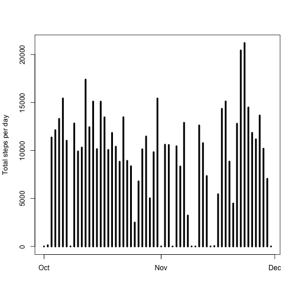
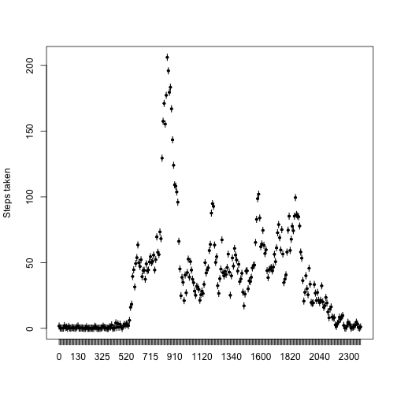
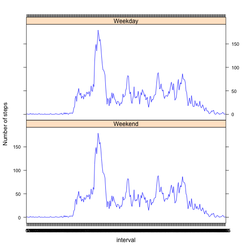

## Loading and preprocessing the data

Dataset: [Activity Monitoring Data][1]  

[1]: https://d396qusza40orc.cloudfront.net/repdata%2Fdata%2Factivity.zip

Let's load the required libraries.  

```r
library(lubridate)
library(dplyr)
library(ggplot2)
library(lattice)
```

Download and unzip the file if it does not exist  

```r
url <- "https://d396qusza40orc.cloudfront.net/repdata%2Fdata%2Factivity.zip"
dbzipfile <- "database.zip"
if (!file.exists(dbzipfile)) {
  download.file(url, dbzipfile, method="curl")
  unzip(dbzipfile)
}
```

Read the activity file (activity.csv)  

```r
activity <- read.csv("activity.csv")
```

## What is mean total number of steps taken per day?
The date variable is read in as a character string. Convert the date variable to POSIXlt format and sum up the steps per day.


```r
activity$date <- with(activity, strptime(date, "%Y-%m-%d"))

daily_summary <- activity %>% group_by(date) %>% summarize(total = sum(steps, na.rm = TRUE))
```

Histogram of the total number of steps taken each day

```r
with(daily_summary, plot(date, total, type="h", ylab="Total steps per day", xlab="", lwd=4))
```



Mean of steps taken per day is 9354.2295082. Median of steps taken per day is 10395

## What is the average daily activity pattern?
Make a time series plot (i.e. type = "l") of the 5-minute interval (x-axis) and the average number of steps taken, averaged across all days (y-axis)

```r
## convert every 5 min interval into a factor variable
activity$interval <- as.factor(activity$interval)

interval_summary <- activity %>% group_by(interval) %>% summarize(mean = mean(steps, na.rm=TRUE))
with(interval_summary, plot(interval, mean, type="l", ylab="Steps taken", xlab="", lwd=4))
```



Which 5-minute interval, on average across all the days in the dataset, contains the maximum number of steps?

```r
filter(interval_summary, mean == max(interval_summary$mean))
```

```
## # A tibble: 1 x 2
##   interval  mean
##   <fct>    <dbl>
## 1 835       206.
```


## Imputing missing values
1. Calculate and report the total number of missing values in the dataset (i.e. the total number of rows with NAs)

```r
with(activity, sum(is.na(steps)))
```

```
## [1] 2304
```

2. Devise a strategy for filling in all of the missing values in the dataset. The strategy does not need to be sophisticated. For example, you could use the mean/median for that day, or the mean for that 5-minute interval, etc.
3. Create a new dataset that is equal to the original dataset but with the missing data filled in.

My strategy is to compute the missing value by taking the median of steps in the same time interval for all other days. Once the missing values are filled in, we ungroup the data and regroup it based on date. With date grouped data, we can calculate daily total.


```r
# make a copy
activity2 = data.frame(activity)

activity2 <- activity2 %>% group_by(interval)
activity2$steps[is.na(activity2$steps)] <- median(activity2$steps, na.rm=TRUE)

daily_summary2 <- activity2 %>% ungroup() %>% group_by(date) %>% summarize(total = sum(steps, na.rm = TRUE))
```

Histogram with missing values filled in

```r
with(daily_summary2, plot(date, total, type="h", ylab="Steps taken", xlab="", lwd=4))
```


4. Report the mean and median total number of steps taken per day. Do these values differ from the estimates from the first part of the assignment? What is the impact of imputing missing data on the estimates of the total daily number of steps?

daily_summary contains daily totals with missing data. daily_summary2 contains daily totals with filled in missing data. Lets compare the two.


```r
comparison <- data.frame(c(mean(daily_summary$total), 
                           median(daily_summary$total)), 
                         c(mean(daily_summary2$total), 
                           median(daily_summary2$total)))
names(comparison) <- c("Missing", "Computed")
row.names(comparison) <- c("Mean", "Median")
comparison
```

```
##         Missing Computed
## Mean    9354.23  9354.23
## Median 10395.00 10395.00
```

Comparison shows that there is no difference between missing data and simulated data based on our strategy.


## Are there differences in activity patterns between weekdays and weekends?
Create a new factor variable in the dataset with two levels -- "weekday" and "weekend" indicating whether a given date is a weekday or weekend day.

```r
# Start with original
activity3 = data.frame(activity)

# Create a new factor variable weekend (logical TRUE for weekend)
activity3$weekend <- (day(activity3$date) %in% c(1,7))

# Fill in missing steps as before
activity3 <- activity3 %>% group_by(interval)
activity3$steps[is.na(activity3$steps)] <- median(activity3$steps, na.rm=TRUE)

# Average steps taken across all days for a given interval
interval_summary <- activity3 %>% summarize(mean = mean(steps), weekend = weekend)
```


Make a panel plot containing a time series plot (i.e. type = "l") of the 5-minute interval (x-axis) and the average number of steps taken, averaged across all weekday days or weekend days (y-axis).  


```r
wend <- factor(interval_summary$weekend, labels = c("Weekend", "Weekday"))

xyplot(mean ~ interval | wend,
       data = interval_summary,
       ylab = "Number of steps",
       type = "l",
       layout = c(1, 2),
       col="blue")
```



  
**There are no major differences between activities on weekdays or weekends.**
